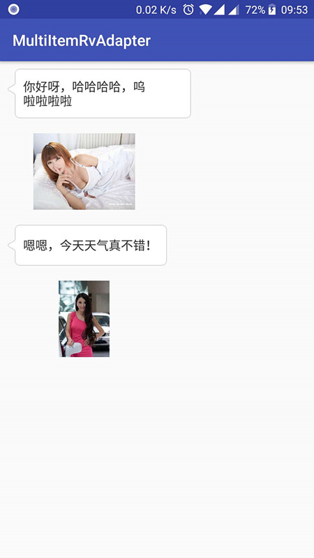

#### 项目介绍

&emsp;&emsp;该项目是在[BaseRecyclerViewAdapterHelper](https://github.com/CymChad/BaseRecyclerViewAdapterHelper "BaseRecyclerViewAdapterHelper")基础上对BaseQuickAdapter进行封装，在包含**BaseRecyclerViewAdapterHelper**所有功能的基础上，对其中的多条目布局处理逻辑进行了封装，将adapter中每种子条目单独出对应的ItemProvider，这样方便相应条目做相关的业务逻辑。

#### BaseRecyclerViewAdapterHelper

&emsp;&emsp;[BaseRecyclerViewAdapterHelper](https://github.com/CymChad/BaseRecyclerViewAdapterHelper "BaseRecyclerViewAdapterHelper")是一个封装好的万能RecyclerView的适配器，可以方便快捷地完成adapter的编写，包含一种或多种子条目的处理且拥有许多强大的功能，比如上拉加载更多、支持添加动画、可以添加子条目的点击、长按事件、添加头部和底部等，现拥有12.6K多的star数，受到不少Android开发者的青睐，我在项目的开发中也使用BaseRecyclerViewAdapterHelper，是一名忠实的粉丝。

#### BaseRecyclerViewAdapterHelper 多条目布局的不足之处
&emsp;&emsp;BaseRecyclerViewAdapterHelper中对多条目布局的逻辑都放在convert()方法中，通过判断对应的itemViewTyper来进行相应子条目的处理，当条目特别多以及拥有复杂业务逻辑的情况，convert()中的处理将会特别多，不便于往后项目的维护，比如IM里面的消息列表，有文本、图片、语音、位置、红包、转账等，有很多种不同布局，对应的逻辑也比较多，在只使用BaseRecyclerViewAdapterHelper的情况下，对应消息列表的adapter代码就已经破一千行，全部条目的逻辑都在一个adapter种，觉得不是特别合理，如下是消息列表的adapter:

    public class MessageListAdapter extends BaseQuickAdapter<Message,BaseViewHolder>{

    public static final int TYPE_TEXT = 0;
    public static final int TYPE_IMG = 1;

    public MessageListAdapter(int layoutResId, @Nullable List<Message> data) {
	        super(layoutResId, data);
	
	        setMultiTypeDelegate(new MultiTypeDelegate<Message>() {
	            @Override
	            protected int getItemType(Message message) {
	                if (message instanceof TextMessage){
	                    return TYPE_TEXT;
	                }else if (message instanceof ImageMessage){
	                    return TYPE_IMG;
	                }
	                // else if(){
	                //     //还有其他消息类型，比如语音、位置、红包、转账等
	                // }
	
	                return 0;
	            }
	        });
	
	        getMultiTypeDelegate()
	                .registerItemType(TYPE_TEXT, R.layout.item_text_message)
	                .registerItemType(TYPE_IMG, R.layout.item_image_message);
					//还有其他消息类型，比如语音、位置、红包、转账等
	    }
	
	    @Override
	    protected void convert(BaseViewHolder helper, Message item) {
	        int viewType = helper.getItemViewType();
	        switch (viewType){
	            case TYPE_TEXT:
	                //文本消息的业务逻辑
	
	                break;
	            case TYPE_IMG:
	                //图片消息的业务逻辑
	
	                break;
	             // case 语音、位置、红包、转账等
	            // break;
	        }
	    }
	}

&emsp;&emsp;当子条目有许多种的时候，convert()中的逻辑将会很多，不便于项目的维护，故而封装了MultipleItemRvAdapter，将每个条目的逻辑处理都交给创建的ItemProvider来处理，这样可以在对应条目的ItemProvider写相应的逻辑，方便维护。

#### 如何使用MultipleItemRvAdapter

一、创建对应条目的ItemProvider，继承BaseItemProvider，注解ItemProviderTag中填写对应的viewType的值（建议在对应的adapter中定义常量，每种条目的viewType必须唯一）, layout指定对应条目的布局id。

比如文本消息条目的provider：

	/**
	 * @author ChayChan
	 * @description 文本消息条目的provider
	 * @date 2018/3/21  14:43
	 */
    @ItemProviderTag(
        viewType = MessageListAdapter.TYPE_TEXT,
        layout = R.layout.item_text_message
	)
	public class TextMessageItemProvider extends BaseItemProvider<TextMessage> {

	    @Override
	    public void convert(BaseViewHolder helper, TextMessage data, int position) {
            //处理相关业务逻辑
	        helper.setText(R.id.tv_text, data.text);
	    }
	
	    @Override
	    public void onClick(BaseViewHolder helper, TextMessage data, int position) {
			//单击事件
	        Toast.makeText(mContext, "Click: " + data.text, Toast.LENGTH_SHORT).show();
	    }
	
	    @Override
	    public boolean onLongClick(BaseViewHolder helper, TextMessage data, int position) {
			//长按事件
	        Toast.makeText(mContext, "longClick: " + data.text, Toast.LENGTH_SHORT).show();
	        return true;
	    }
	}

图片消息条目的provider：

    /**
	 * @author ChayChan
	 * @description 图片消息条目的provider
	 * @date 2018/3/21  14:43
	 */
	@ItemProviderTag(
	        viewType = MessageListAdapter.TYPE_IMG,
	        layout = R.layout.item_image_message
	)
	public class ImageMessageItemProvider extends BaseItemProvider<ImageMessage> {
	
	    @Override
	    public void convert(BaseViewHolder helper, ImageMessage data, int position) {
	        //处理相关业务逻辑
	        ImageView iv = helper.getView(R.id.iv_img);
	        Glide.with(mContext).load(data.imgUrl).into(iv);
	    }
	
	    @Override
	    public void onClick(BaseViewHolder helper, ImageMessage data, int position) {
	        //单击事件
	        Toast.makeText(mContext, "Click: " + data.imgUrl, Toast.LENGTH_SHORT).show();
	    }
	
	    @Override
	    public boolean onLongClick(BaseViewHolder helper, ImageMessage data, int position) {
	        //长按事件
	        Toast.makeText(mContext, "longClick: " + data.imgUrl, Toast.LENGTH_SHORT).show();
	        return true;
	    }
	}

ItemProvider的convert()方法中用于处理相应的业务逻辑，onClick()中用于处理条目的单击事件，onLongClick()中用于处于条目的长按事件；尽管单击和长按事件adapter中可以通过ssetOnItemClick(）和setOnItemLongClick()来处理，但是这里还是有将这两个事件交于itemProvider,开发者可以根据具体需要选择使用其中一种方式。

二、创建对应的adapter，继承MultipleItemRvAdapter，如MessageListAdapter:

    /**
	 * @author ChayChan
	 * @description: 消息列表的adapter
	 * @date 2018/3/21  14:40
	 */
	
	public class MessageListAdapter extends MultipleItemRvAdapter<Message> {

	    public static final int TYPE_TEXT = 0;
	    public static final int TYPE_IMG = 1;
	
	    public MessageListAdapter(@Nullable List<Message> data) {
	        super(data);

	  		//构造函数若有传参可以在调用finishInitialize()之前进行赋值，赋值给全局变量
	        //这样getViewType()和registerItemProvider()方法中可以获取到传过来的值
	        //getViewType()中可能因为某些业务逻辑，需要将某个值传递过来进行判断，返回对应的viewType
	        //registerItemProvider()中可以将值传递给ItemProvider
	        
			finishInitialize();
	    }
	
	    @Override
	    protected int getViewType(Message message) {
			//返回对应的viewType
	        if (message instanceof TextMessage) {
	            return TYPE_TEXT;
	        } else if (message instanceof ImageMessage) {
	            return TYPE_IMG;
	        }
	        return 0;
	    }
	
	
	    @Override
	    public void registerItemProvider() {
			//注册相关的条目provider
            mProviderDelegate.registerProvider(new TextMessageItemProvider()); //注册文本消息条目的itemProvider
            mProviderDelegate.registerProvider(new ImageMessageItemProvider());//注册图片消息条目的itemProvider
	    }

	}

&emsp;&emsp;adapter中需要实现getViewType()和registerItemProvider()两个方法。getViewType()通过判断相关逻辑返回不同的viewType,registerItemProvider()用于注册自己所定义的所有子条目的ItemProvider。

三、为RecyclerView设置相应的adapter:

    	mRvMessages = findViewById(R.id.rv_message);

        mRvMessages.setHasFixedSize(true);
        mRvMessages.setLayoutManager(new LinearLayoutManager(this));

        String imgUrl1 = "https://timgsa.baidu.com/timg?image&quality=80&size=b9999_10000&sec=1521627479112&di=7b109af49f8c1c193c3173306cf58680&imgtype=0&src=http%3A%2F%2Fimg.xgo-img.com.cn%2Fpics%2F1538%2F1537620.jpg";
        String imgUrl2 = "https://timgsa.baidu.com/timg?image&quality=80&size=b10000_10000&sec=1521617426&di=d6537bb0ef71984e4a1d14e4b18ba169&src=http://img1d.xgo-img.com.cn/pics/789/788784.jpg";

        mMessages.add(new TextMessage("你好呀，哈哈哈哈，呜啦啦啦啦"));
        mMessages.add(new ImageMessage(imgUrl1));
        mMessages.add(new TextMessage("嗯嗯，今天天气真不错！"));
        mMessages.add(new ImageMessage(imgUrl2));

        mRvMessages.setAdapter(new MessageListAdapter(mMessages));

效果图：

&emsp;&emsp;由于该库中包含BaseRecyclerViewAdapterHelper库，所以BaseRecyclerViewAdapterHelper拥有的它也具有。

#### 导入方式

在项目根目录下的build.gradle中的allprojects{}中，添加jitpack仓库地址，如下：

    allprojects {
	    repositories {
	        jcenter()
	        maven { url 'https://jitpack.io' }//添加jitpack仓库地址
	    }
	}
 
打开app的module中的build.gradle，在dependencies{}中，添加依赖，如下：

    dependencies {
	        compile 'com.github.chaychan:MultipleItemRvAdapter:1.0.0' //建议使用最新版本
	}

最新发布的版本可以查看 

[https://github.com/chaychan/MultipleItemRvAdapter/releases](https://github.com/chaychan/MultipleItemRvAdapter/releases)

#### 支持和鼓励

&emsp;&emsp;如果觉得对你有帮助，请帮忙star一下，让更多人可以看到，谢谢！这样我会更加有动力去完善好这个项目；
	